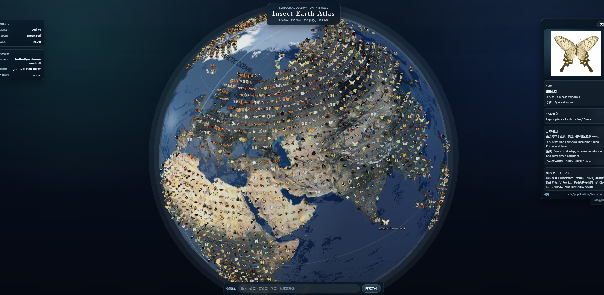

# Insects Earth(VIBE CODING)




# Insect Earth Atlas

3D 昆虫生态地球百科（Insect Earth Atlas）是一个基于 React + Three.js 的交互式科普项目。  
页面中心为可拖拽缩放的 3D 地球，昆虫标记通过真实陆地 GeoJSON 约束，只在大陆网格内分布，并支持检索、筛选、聚焦、飞舞/归巢等交互。

## 项目亮点

- 3D 地球舞台：高质量地球材质、云层与大气氛围、星空背景。
- 陆地约束布点：基于 `@turf/turf` 的 `point-in-polygon`，点位不会落到海洋。
- 网格化生态视图：将陆地区域离散为网格单元，每格放置一个昆虫标记。
- 真实物种数据：含蝴蝶与蜜蜂物种数据（中文名/英文名/学名/分布/生态信息）。
- 搜索与定位：Fuse.js 模糊搜索，支持点击结果自动旋转聚焦并打开详情。
- 飞舞/归巢动画：支持反复切换并精确回位，避免累计漂移。
- 工程可扩展：数据层、地理层、渲染层、UI 层解耦，便于后续升级。

## 技术栈

- React 19 + TypeScript + Vite
- Three.js + React Three Fiber + Drei
- Zustand（全局状态）
- Fuse.js（模糊搜索）
- Turf.js（地理空间计算）
- CSS（模块化样式组织）

## 快速开始

### 1. 环境要求

- Node.js >= 18（建议 20+）
- npm >= 9

### 2. 安装依赖

```bash
npm install
```

### 3. 启动开发环境

```bash
npm run dev
```

默认访问：`http://localhost:5173`

### 4. 构建生产包

```bash
npm run build
```

### 5. 本地预览构建结果

```bash
npm run preview
```

## 常用命令

```bash
npm run dev        # 开发模式
npm run typecheck  # TypeScript 类型检查
npm run lint       # ESLint 检查
npm run build      # 生产构建
npm run preview    # 预览构建产物
```

## 交互说明

- 鼠标左键拖拽：旋转地球
- 鼠标滚轮：缩放地球
- 点击昆虫标记：高亮并镜头聚焦，打开详情面板
- 点击空白区域：取消选中并回到概览镜头
- 底部搜索：输入中文名/英文名/学名/标签，回车或点击结果定位
- 分类筛选：全部 / 蝴蝶 / 蜜蜂
- 飞舞模式：切换“飞舞 / 归巢”状态

## 目录结构

```text
src/
  app/                 # 应用入口、页面壳与全局样式
  assets/              # 地球与UI静态资源清单
  components/
    earth/             # 地球场景、控制器、光照、标签
    insects/           # 昆虫标记渲染与动画
    search/            # 搜索框与结果列表
    filters/           # 分类筛选
    panels/            # 详情面板
  data/
    geo/               # 陆地 GeoJSON 与元信息
    insects/           # 物种数据、网格分配、投影点位
  hooks/               # Zustand selector hooks
  store/               # 全局状态与行为
  types/               # 领域模型定义
  utils/
    geo/               # 经纬度转换、陆地检测、网格构建
    search/            # Fuse 索引与查询
scripts/
  generate_transparent_markers.py  # 透明昆虫贴图生成脚本
public/
  earth/               # 地球贴图
  insects/cutouts/     # 昆虫透明标记图
```

## 数据与资源说明

### 地理数据

- 陆地掩膜：Natural Earth `1:110m Land`
- 文件：`src/data/geo/land.geo.json`
- 用途：陆地合法性检测（过滤海洋点位）

### 昆虫物种数据

- 文件：`src/data/insects/mockInsects.ts`
- 字段覆盖：分类信息、名称、学名、分布、生境、生态角色、图片、来源等
- 运行时会经过 `validatedMockInsects.ts` 做陆地有效性校验

### 透明贴图生成（可选）

如需更新昆虫透明标记图：

```bash
python scripts/generate_transparent_markers.py
```

脚本会读取 `mockInsects.ts` 中的图源，尝试抠出单个主体并输出到 `public/insects/cutouts/`。  
该脚本依赖 Python 包：`requests`、`Pillow`、`numpy`、`rembg`。

## 当前实现范围

- 已实现正式工程化结构（非单文件 demo）
- 已集成大陆过滤、网格铺设、交互聚焦、搜索筛选、飞舞动画
- 已接入较大规模蝴蝶/蜜蜂物种数据，并按区域参与网格分配

## 后续规划

- 标记层性能升级：Sprite/Plane -> InstancedMesh + Texture Atlas
- 数据源升级：本地 mock -> API/数据库服务
- 多端部署：展馆大屏、桌面端、离线数据包
- 视觉升级：更高质量后期效果与昼夜光照模式

## License

项目代码遵循仓库 License；昆虫图片与地理数据遵循各自来源页面与数据源许可条款。  
请在对外发布时保留物种来源与图片署名信息。
